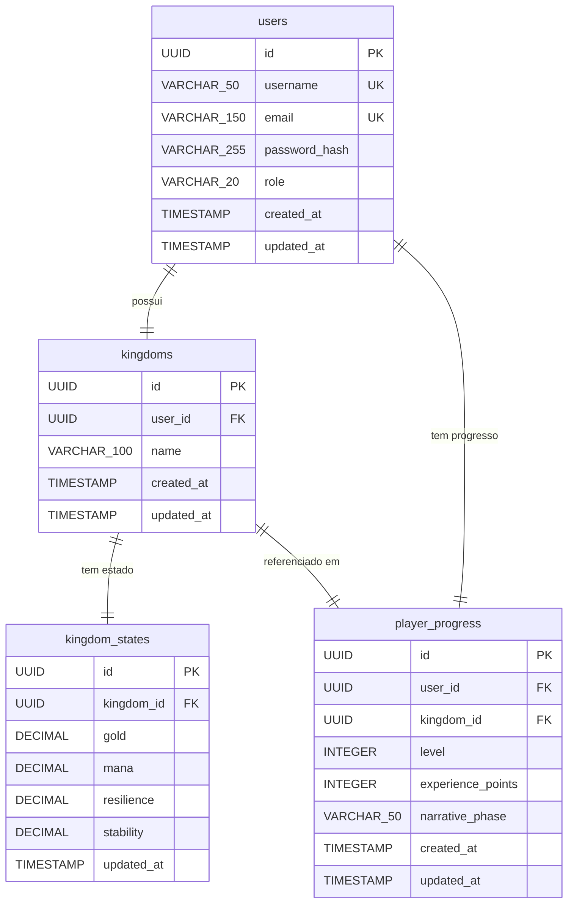

# Modelagem de Dados — Detalhe Técnico

## Objetivo deste documento

Detalhar as tabelas implementadas no banco de dados, seus campos, tipos, restrições e relações. Complementa o `data-model-overview.md`, que permanece conceitual.

## Quando usar

Use este documento ao criar ou revisar migrations, mapear entidades JPA, escrever queries ou entender relações entre tabelas.

## Diagrama de Entidades e Relações (ERD)

## Tabelas

### `users`

Representa a conta principal da plataforma.

| Campo | Tipo | Restrições | Descrição |
|---|---|---|---|
| `id` | UUID | PK, not null | Identificador único gerado pelo banco |
| `username` | VARCHAR(50) | unique, not null | Nome de exibição do usuário |
| `email` | VARCHAR(150) | unique, not null | E-mail de acesso à conta |
| `password_hash` | VARCHAR(255) | not null | Senha criptografada com BCrypt |
| `role` | VARCHAR(20) | not null | Perfil de acesso: `PLAYER` ou `ADMIN` |
| `created_at` | TIMESTAMP | not null, default now() | Data de criação da conta |
| `updated_at` | TIMESTAMP | not null, default now() | Última atualização do registro |

---

### `kingdoms`

Representa a instância jogável associada ao usuário.

| Campo | Tipo | Restrições | Descrição |
|---|---|---|---|
| `id` | UUID | PK, not null | Identificador único |
| `user_id` | UUID | FK → users.id, not null | Dono do reino |
| `name` | VARCHAR(100) | not null | Nome dado ao reino pelo usuário |
| `created_at` | TIMESTAMP | not null, default now() | Data de criação do reino |
| `updated_at` | TIMESTAMP | not null, default now() | Última atualização do registro |

**Relações:**
- `user_id` → `users.id`: cada reino pertence a um usuário (1:1 no MVP)

---

### `kingdom_states`

Snapshot dos recursos financeiros do reino em seu estado atual. É o que o motor do jogo lê e atualiza a cada ação do jogador.

| Campo | Tipo | Restrições | Descrição |
|---|---|---|---|
| `id` | UUID | PK, not null | Identificador único |
| `kingdom_id` | UUID | FK → kingdoms.id, unique, not null | Reino ao qual o estado pertence |
| `gold` | DECIMAL(15,2) | | Representa o saldo disponível |
| `mana` | DECIMAL(15,2) | | Representa a liquidez |
| `resilience` | DECIMAL(15,2) | | Representa a reserva de emergência |
| `stability` | DECIMAL(5,2) | | Índice geral de saúde do reino (0–100) |
| `updated_at` | TIMESTAMP | not null, default now() | Última atualização do estado |

**Relações:**
- `kingdom_id` → `kingdoms.id`: relação 1:1 — cada reino tem exatamente um estado atual

**Nota:** `kingdom_states` não possui `created_at` pois representa sempre o estado presente, não um histórico. Snapshots históricos são funcionalidade de fase posterior.

---

### `player_progress`

Registra o progresso narrativo e de progressão do jogador dentro da experiência.

| Campo | Tipo | Restrições | Descrição |
|---|---|---|---|
| `id` | UUID | PK, not null | Identificador único |
| `user_id` | UUID | FK → users.id, not null | Usuário a quem pertence o progresso |
| `kingdom_id` | UUID | FK → kingdoms.id, not null | Reino vinculado ao progresso |
| `level` | INTEGER | not null, default 1 | Nível atual do jogador |
| `experience_points` | INTEGER | not null, default 0 | Pontos acumulados de experiência |
| `narrative_phase` | VARCHAR(50) | | Fase narrativa atual do jogador |
| `created_at` | TIMESTAMP | not null, default now() | Data de início do progresso |
| `updated_at` | TIMESTAMP | not null, default now() | Última atualização do registro |

**Relações:**
- `user_id` → `users.id`: progresso pertence ao usuário
- `kingdom_id` → `kingdoms.id`: progresso está vinculado ao reino

**Nota de consistência:** a combinação `user_id + kingdom_id` deve sempre apontar para um reino que pertença ao mesmo usuário. Essa consistência é garantida pela camada de serviço no MVP. Constraint composta no banco registrada como débito técnico consciente para fases futuras.

---

## Relações de alto nível (MVP)

| Relação | Cardinalidade | Observação |
|---|---|---|
| `users` → `kingdoms` | 1:1 | Um usuário tem um reino no MVP |
| `kingdoms` → `kingdom_states` | 1:1 | Um reino tem um estado atual |
| `users` → `player_progress` | 1:1 | Um usuário tem um registro de progresso no MVP |
| `kingdoms` → `player_progress` | 1:1 | Um reino é referenciado em um progresso no MVP |

## Débitos técnicos registrados

- **Constraint composta em `player_progress`:** a integridade entre `user_id` e `kingdom_id` é garantida pela camada de serviço no MVP. Uma constraint composta no banco (`user_id + kingdom_id` como FK composta referenciando `kingdoms`) deve ser avaliada quando houver mais de um colaborador com acesso direto ao banco ou quando scripts de importação de dados forem introduzidos.

## Decisões tomadas

- Todas as PKs usam UUID para evitar enumeração e facilitar escala futura.
- Senhas são armazenadas como hash BCrypt — nunca em texto puro.
- O campo `role` em `users` entra desde o MVP para suportar Spring Security sem retrabalho futuro.
- `kingdom_states` não guarda histórico — apenas o estado atual. Histórico é funcionalidade futura.
- A consistência entre `user_id` e `kingdom_id` em `player_progress` é responsabilidade da camada de serviço no MVP.

## Pontos para revisar depois

- Adicionar tabelas de `narrative_events`, `income_sources`, `contextual_tips` e `behavior_logs` quando entrarem no desenvolvimento.
- Avaliar constraint composta em `player_progress` antes de abrir acesso administrativo ao banco.
- Definir estratégia de histórico de `KingdomState` quando snapshots temporais forem necessários.
- Revisar cardinalidades quando multiplayer ou múltiplos reinos por usuário entrarem no roadmap.
